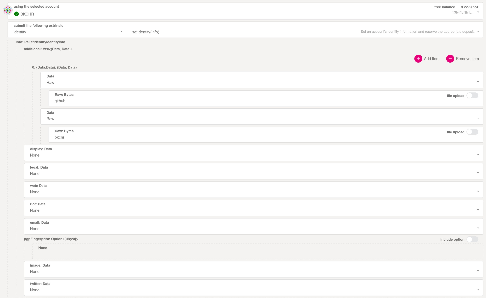

# Get Fellows Action

GitHub action to fetch all the fellows information.

This action fetches all the fellows from the [on-chain data](https://polkadot.js.org/apps/?rpc=wss%3A%2F%2Fkusama-rpc.polkadot.io#/fellowship) and output two objects with the fellows data and with the users’ GitHub information.

It looks in the fellows data for a field named `GitHub` and it extracts the handle from there.

This action is intended to be chained with other actions that requires the fellows GitHub handles.

## Installation
This action is intended to be chained with other actions. It does not have any requirements.

We simply need to add the step:
```yaml
- uses: paritytech/get-fellows-action
  id: fellows
```

A working example where we print all the names is the following:
```yaml
name: Mention fellows

on: [push]

jobs:
  mention-fellows:
    runs-on: ubuntu-latest
    steps:
      - uses: paritytech/get-fellows-action
        id: fellows
      - name: Mention them
        run: |
          echo "The fellows are $FELLOWS"
        env:
          # the handles of the fellows separated by commas
          FELLOWS: ${{ steps.fellows.outputs.github-handles }}"
```

### Outputs
You can find all the outputs in the [`action.yml` file](./action.yml).

They are:
- `fellows`: A JSON array with objects of type  "address": "1e2345...", "rank": rank (as a number), “githubHandle”: “handle (can be null)”
	- Example: `[{"address":"1e2345...",rank: 4, "githubHandle":"user-1"},{"address":"1e4532...",rank: 3, "githubHandle":"user-2"},{"address":"1e8335...",rank: 6}]`
- `github-handles`: All the fellows handles separated by commas
	- Example: `user-1,user-2,user-3`

## Adding github account to your on-chain identity

Adding the github account to your identity requires the usage of the `additional` fields in the identity info. The identity needs to be set on Polkadot. This is currently only supported by using the [polkadot-js bare extrinsic interface](https://polkadot.js.org/apps/?rpc=wss%3A%2F%2Frpc.polkadot.io#/extrinsics/decode/0x1c010407676974687562123c67697468756220757365726e616d653e0000000000000000). See the following image for an example:



If you have other identity fields (`display`, `legal`, `email`, etc) already configured on-chain, you have to repeat them in this extrinsic (`None` values will override the existing information).


## Deployment

To deploy a new version you need to update two files:
- [`package.json`](./package.json): Update the version number.
- [`action.yml`](./action.yml): Update the image number in `runs.image`.
**Important**: Both versions must have the same number.

When a commit is pushed to the main branch and the versions have changed, the system will automatically tag the commit and release a new package with such version.

You can find all the available versions in the [release section](./releases).
